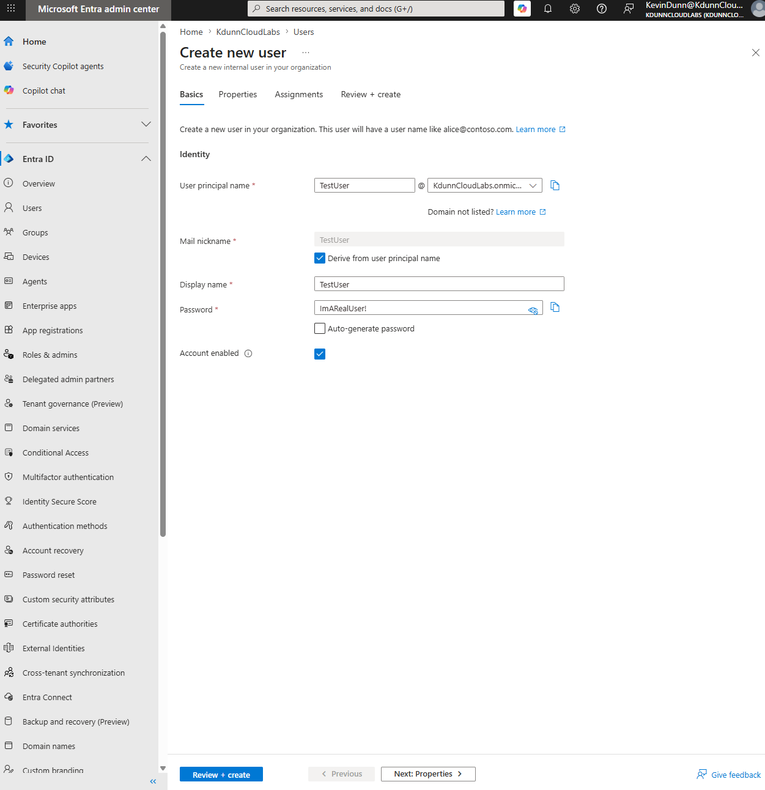
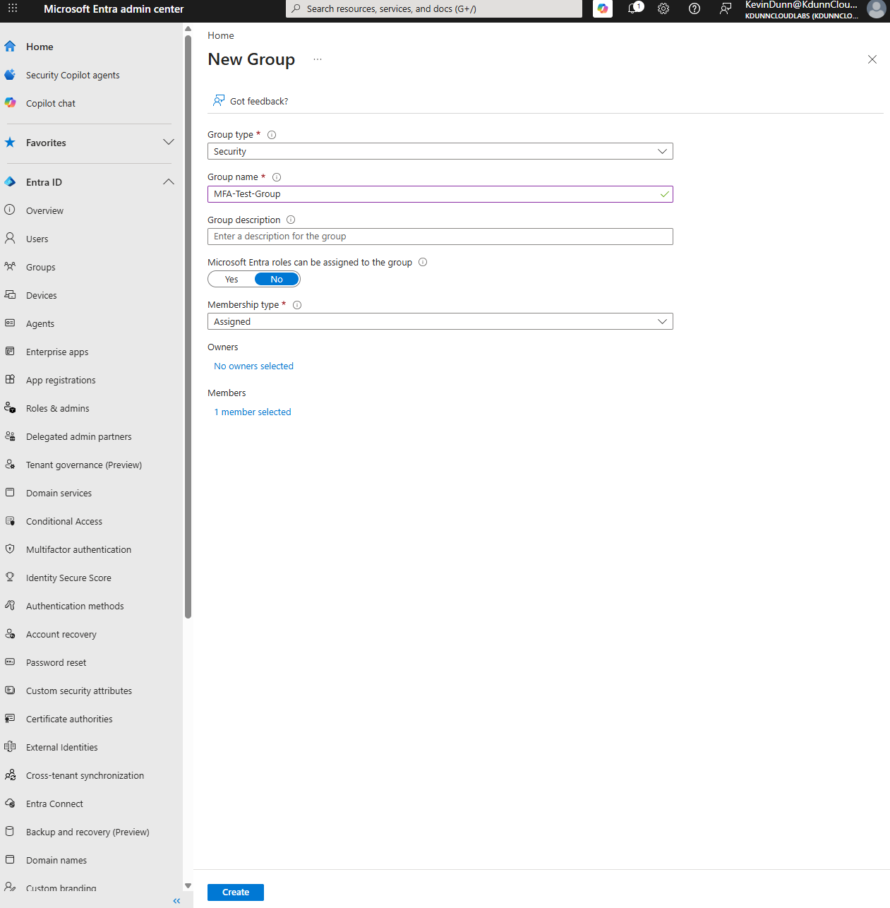
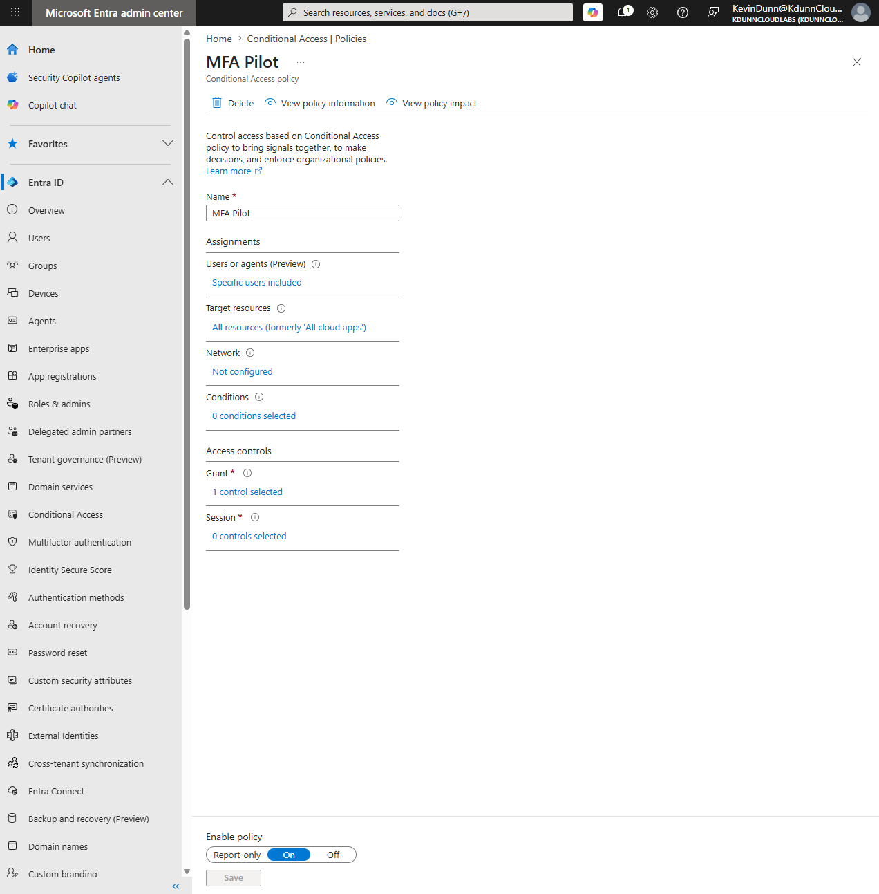

# Lab 02: Policy-Driven MFA via Microsoft Entra Conditional Access

## 🎯 Lab Objective
To demonstrate the migration of an enterprise cloud tenant from static, unconfigurable global Security Defaults to an agile, context-aware Zero Trust identity boundary using **Microsoft Entra Conditional Access**. The implementation establishes an explicit identity-verification checkpoint, targeting scoped user groups to enforce multifactor authentication (MFA) while mitigating administrative lockout risks and reducing post-lab attack surfaces.

## ⚙️ Architectural Context
Microsoft Entra tenants ship with **Security Defaults** enabled out-of-the-box. While secure for basic setups, Security Defaults apply a broad, unconfigurable policy block that restricts the use of granular Conditional Access logic. Transitioning a tenant to custom Conditional Access policies allows an organization to implement advanced, context-aware rule blocks based on identity, device compliance, location, and application risk.

---

## 🛠️ Execution Walkthrough

### Step 1: Target Identity Provisioning
To isolate testing from production administrators, a dedicated non-privileged identity was created via **Identity > Users > All Users**.
* **Display Name:** `Test User`
* **User Principal Name (UPN):** `testuser@KdunnCloudLabs.onmicrosoft.com`
* **Administrative Roles:** None (Standard User)

### Step 2: Directory Group Security Architecture
To implement scalable access control, permissions were mapped to a security group rather than an individual account. Navigated to **Identity > Groups > All Groups** and initialized the directory object:
* **Group Type:** Security
* **Group Name:** `MFA-Test-Group`
* **Membership Type:** Assigned
* **Direct Members:** `testuser`

### Step 3: Tenant Posture Hardening & Transition
1. Navigated to **Identity > Overview > Properties**.
2. Selected **Manage security defaults** at the base of the blade.
3. Toggled the configuration to **Disabled**, selecting *'My organization is using Conditional Access'* as the technical justification.

This step safely transitioned the tenant control plane to an advanced enterprise posture, allowing custom evaluation rule blocks to take effect.

### Step 4: Engineering the Conditional Access Policy
Navigated to **Identity > Protection > Conditional Access** and initialized a new policy block designated as **"MFA Pilot"** utilizing the following technical specifications:

| Policy Blade Section | Parameter Configuration | Technical Justification |
| :--- | :--- | :--- |
| **Assignments: Users** | Include: `MFA-Test-Group` | Scopes policy strictly to test objects; eliminates global administrative lockout risks. |
| **Target Resources** | Include: **All resources** *(formerly 'All cloud apps')* | Ensures comprehensive coverage across all portals, APIs, and data management planes. |
| **Access Controls: Grant** | Control: **Require multifactor authentication** | Intercepts tokens to mandate secondary cryptographic proof before issuing a SAML/OIDC claim. |
| **Enable Policy** | State: **On** | Bypasses *Report-only* mode to immediately enforce live evaluation. |

---

## 🛡️ Defensive Engineering Takeaways
* **Scope Isolation (Lockout Prevention):** Applying policy rules globally without structural exclusion filters poses a significant administrative lockout risk. Scoping the pilot policy explicitly to an assigned Security Group (`MFA-Test-Group`) safeguards production administrative access during the rollout phase.
* **Granular Policy Control vs. Security Defaults:** While Security Defaults provide an easy baseline, they force a tenant into an "all-or-nothing" posture. Shifting to Conditional Access gives security teams the power to exempt legacy service accounts, adjust policies for regional offices, or enforce strict step-up authentication exclusively for high-privilege apps.

---

## 🔒 Post-Lab Hardening & Incident Lifecycle Actions
* **Identity Lifecycle Decommissioning:** Following successful functional validation of the identity checkpoint, the `testuser` account status was explicitly modified within the Entra directory to **Account Status: Disabled**. In production cloud architecture, leaving unmonitored test accounts active provides opportunistic actors a vector for password spraying and initial access. Defensive cleanup reduces the tenant's persistent attack surface.
